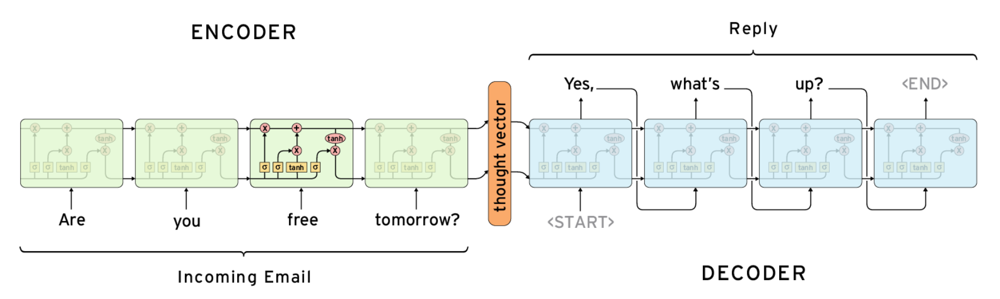
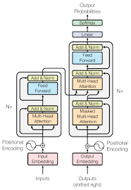

# Introduction
Dwayne The Bot Chatson is an open domain chatbot with whom you can have random conversations via Telegram. 
It is trained on dialogs from movies thus Dwayne can be poetic or temperamental at times.

# Data
We concatenated two open-source datasets for training of our NLP model. 
The [rDany Chat datset] (https://www.kaggle.com/eibriel/rdany-conversations) mimics 
conversations of a human with his virtual companion. In addition the
[Cornell Movie-Dialogs Corpus] (https://www.cs.cornell.edu/~cristian/Cornell_Movie-Dialogs_Corpus.html)
consists of conversational exchanges from movie scripts.

# Models
### 1. Seq2Seq Model with Attention
The seq2seq model is a basic encoder-decoder architecture with attention.
The architecture looks as follows:
  
The model's code you will find it on the ```chatbot/model_v1``` folder. The code for the
inference itself is located on the ```seq2seq_with_attention.py``` file. The model is
built, the weights and embeddings loaded and then the function reply is used on the
```chatbot/bot/handlers.py``` file for the inference part.  

### 2. Transformer 
The transformer is based on [tensorflow's transformer online tutorial](https://www.tensorflow.org/tutorials/text/transformer).
The architecture of the model looks as follows:
  
The model's code you will find it on the ```chatbot/model_v2``` folder. The code for the
inference itself is located on the ```transformer.py``` file. The model is build, the 
weights and embeddings loaded and then the function reply is used on the 
```chatbot/bot/handlers.py``` file for the interface part.

# The Notebooks
```DataAnalyser.ipynb```  
This notebook is an early version of the analysis of the rDany dataset. How many data
points there are and so on.  
  
```LSTM_GloVe.ipynb```  
On this notebook we simply were testing how LSTM works with Glove embeddings so that
we can use it on our seq2seq architecture.  

```Preliminary_Model.ipynb```  
An very early version of seq2seq trained only on rDany dataset.  

```seq2seq_attention.ipynb```  
The preliminary model now with attention.  

```seq2seq_attention_glove.ipynb```  
The seq2seq model with attention now using the Glove embeddings.

```seq2seq_attention_glove_50d.ipynb```  
A more fine-grained version of the previous.

```Stages.ipynb```  
Just a dummy notebook for testing different stages to identify bugs we were having
at the time. (Many of these notebook might have had that as the main purpose.)

```test_first_layers.ipynb``` ```test_inference.ipynb```  
Both these notebook as the name suggests are for testing purposes.  

```transformer.ipynb```  
Transformer notebook.  

# The Drive
Eventhough the code is in the repository here, the training and most of the preprocessing
was done on the drive which you can access using [this link](https://drive.google.com/drive/folders/1noQc8Hp__zgv2kaSYAFYb3GMRZBk1l7f?usp=sharing)

What is on the drive:
1. Notebooks
2. Embeddings
3. Data
4. Trained models

Let's go through each of those:
- All the notebooks that have transformer on their name, are a version of the transformer
- On the rDany folder you will find data
- On the models folder are the save trained models (names speak for themselves)
- On the transformer_models are trained trasnformer models
- General Slides are were we kept our log, meetings and stuff we wanted to share with eachother
- There is also the final presentation on this folder

To run the chatbot, you need to:
1. Clone this repo
2. Download the ```transformer_models/with_embeddings/model_2``` folder on Gdrive
3. Install all packages in ```requirements.txt```
4. Make sure to place the downloaded model_2 folder on the ```chatb`ot/model_v2/``` folder
5. ```cd chatbot```
6. ```python -m bot.bot```